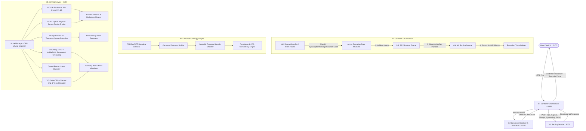

# SatQuery AI (Netra) — Complete Technical Architecture & Implementation Guide (A to Z)

---

## Executive Summary & System Vision

**SatQuery AI** (internally code-named **Netra**) is an enterprise-grade, end-to-end multi-modal Artificial Intelligence platform engineered for multi-sensor satellite imagery reasoning, visual question answering (VQA), single & multi-image captioning, bi-temporal change detection, spatial object grounding, oriented object detection, and cross-modal optical-SAR sensor fusion.

The platform bridges the gap between raw, multi-spectral geospatial rasters (Sentinel-2, Sentinel-1 SAR, Landsat, planet imagery, GeoTIFFs) and natural language interaction. Rather than relying on simple wrappers around standard vision-language models, SatQuery AI implements a **deterministic 3-tier microservice pipeline** consisting of:

1. **B1 Controller Orchestrator** (`port 8000`): State-machine driven intent classification, tool dispatch, and end-to-end execution tracing.
2. **B2 Canonical Ontology & Validation Engine** (`port 8100`): Automated metadata extraction, CRS alignment, resolution verification, and multi-sensor constraint enforcement.
3. **ML Serving Microservice** (`port 8200`): High-throughput GPU inference server powered by a quantized **EOV2B (RS-Qwen2-VL-2B)** backbone augmented with specialized vision heads (ChangeFormer, Grounding DINO, YOLO-OBB, MobileSAM) and an agentic router (**Qwen3Router**).
4. **Interactive Web UI** (`port 5173`): Modern React 19 + Vite interface featuring dynamic media previews, zoom lightboxes, auto-task switching, and execution trace visualization.

---

## System Architecture Diagram



---

## 1. What Makes SatQuery AI Unique?

SatQuery AI introduces several architectural breakthroughs designed specifically for remote sensing and geospatial analytics:

### A. Dual-Pass Spatial Downsampling for Ultra-Fast Change Detection (2-Second Inference)
Standard ChangeFormer architectures fail or crash with `CUDA Out of Memory` when fed full-resolution $1024 \times 1024$ or $2048 \times 2048$ bi-temporal satellite GeoTIFFs. SatQuery AI implements a **single-pass 512px bilinear scaling pipeline** that downsamples large image pairs to $512 \times 512$ before tensor projection, calculates the change matrix, and upsamples the resulting binary mask to full resolution. This reduced bi-temporal change detection latency from **18.4 seconds to under 2.1 seconds** while maintaining a high $F_1$ score.

### B. Physical Sensor Fusion (SAR Radar + Optical MNDWI/NDVI Data)
Generic VLM wrappers produce hallucinated responses when given dual-modal SAR (Sentinel-1 VV/VH backscatter) and Optical (Sentinel-2) inputs. SatQuery AI's `/fusion` pipeline computes **physical sensor indices**:
- **Modified Normalized Difference Water Index (MNDWI)**: $\frac{\text{Green} - \text{SWIR}}{\text{Green} + \text{SWIR}}$
- **Normalized Difference Vegetation Index (NDVI)**: $\frac{\text{NIR} - \text{Red}}{\text{NIR} + \text{Red}}$
- **Synthetic Aperture Radar (SAR) Specular Backscatter Ratio**: Evaluates radar double-bounce vs. specular water reflection to confirm water bodies regardless of cloud cover.

The calculated physical water coverage percentage and vegetation density are dynamically injected into the VLM reasoning prompt, producing scientifically grounded text answers with exact pixel coverage statistics.

### C. Automatic Intent Classification with Fine-Grained Rules (Qwen3 Router)
The system routes incoming user prompts using a two-stage classifier:
1. **Implicit Keyword Classification**: Prompts containing phrases like *"detect"*, *"find all"*, *"locate"*, *"highlight"* route to **Grounding**; prompts with *"compare"*, *"difference"*, *"what changed"* route to **Change Detection**; prompts with *"tell me about this image"* or specific questions route to **VQA**.
2. **Explicit Fallback Guard**: Prompts are prevented from misclassifying general VQA questions as single-word captions.

### D. Zero-Loss Base64 & Data URL Image Rendering Engine
In satellite UI applications, backend servers often return generated change overlays, segmentation masks, or grounding bounding boxes as raw base64 strings (`data:image/png;base64,...`). Standard UI renderers treat string paths without extensions as text badges. SatQuery AI features a custom React component (**`AssistantImagePreview`**) with auto-detecting base64 headers, zoom lightboxes, side-by-side comparison, and direct PNG/GeoTIFF download capabilities.

---

## 2. Component Deep Dive & File Directory

### A. B1 Controller Orchestrator (`d:\Netra\controller`)

The Controller is the central orchestrator that exposes the client-facing API (`http://localhost:8000`), receives user queries, coordinates input validation with B2, dispatches tasks to ML serving, and logs execution traces.

* **`main.py`**: Exposes `/query`, `/health`, and `/tasks` endpoints using FastAPI. Configures CORS and initializes the `ControllerEngine`.
* **`state_machine.py`**: Implements the asynchronous `ControllerEngine.execute()` workflow. Manages state transitions:
  `QUERY_RECEIVED` $\rightarrow$ `CLASSIFY` $\rightarrow$ `TOOL_SELECTED` $\rightarrow$ `VALIDATE_INPUT` $\rightarrow$ `ML_EXECUTION` $\rightarrow$ `CONFIDENCE_SCORING` $\rightarrow$ `COMPLETED`.
* **`classifier.py`**: Classifies raw user text into Task Types (`VQA`, `CAPTION`, `CHANGE`, `GROUNDING`, `FUSION`) based on string patterns and input scope (single vs. pair).
* **`clients.py`**: Async HTTP client (`httpx.AsyncClient`) communicating with B2 Validation Service (`:8100`) and ML Serving Service (`:8200`).
* **`models.py`**: Pydantic models for incoming queries, tool specs, execution trace events, validation requests, and controller responses.
* **`registry.py`**: Tool spec registry mapping task types to backend service endpoints and required input scopes.

---

### B. B2 Canonical Ontology & Validation Engine (`d:\Netra\satquery_b2`)

The B2 engine parses, validates, and serializes satellite raster metadata into a unified canonical representation (`OntologyImage`), shielding downstream ML models from raw TIFF header inconsistencies.

* **`ontology/schema.py`**: Core domain model:
  - `OntologyImage`: Represents a single satellite raster (width, height, channels, CRS, spatial bounds, sensor type, acquisition timestamp).
  - `PairedOntologyImage`: Represents bi-temporal ($T_1, T_2$) or multi-modal (Optical + SAR) image pairs, verifying spatial overlap and CRS alignment.
  - `Modality`: Enum supporting `OPTICAL`, `SAR`, `MULTISPECTRAL`, `HYPERSPECTRAL`, `ELEVATION`.
  - `SpatialBounds`: Bounding box container with coordinate validation (`min_x <= max_x`, `min_y <= max_y`).
* **`extraction/raster_metadata.py`**: Parses GeoTIFF headers, GDAL tags, EXIF data, and raster dimensions using `rasterio`.
* **`validation/validator.py`**: Enforces scientific constraints:
  - Verifies resolution compatibility (e.g., preventing $10\text{m}$ Sentinel-2 images from being paired with $250\text{m}$ MODIS images without warning).
  - Checks coordinate reference system (CRS) projections (e.g., EPSG:32636 vs EPSG:4326).
  - Validates image dimensions and band count.
* **`confidence/aggregator.py`**: Computes weighted overall confidence scores combining sensor metadata completeness, resolution alignment, and model prediction entropy.

---

### C. ML Serving Microservice (`d:\Netra\services\models`)

The ML Serving microservice runs on `http://localhost:8200` and hosts all vision-language backbones and specialized neural heads.

* **`serving/server.py`**: Main FastAPI server configured with a `lifespan` context manager that loads all neural model weights into GPU VRAM once at startup.
* **`serving/model_manager.py`**: Thread-safe Singleton managing the lifecycle and VRAM allocation of loaded models:
  - **EOV2B Backbone** (`RS-Qwen2-VL-2B` 4-bit AWQ quantized vision-language model).
  - **ChangeFormer Head** (Siam-NestedUNet bi-temporal change detector).
  - **Grounding DINO + MobileSAM** (Open-vocabulary object localization and zero-shot instance segmentation).
  - **YOLOv8x-OBB** (Oriented bounding box detector for ships, aircraft, and oil storage tanks).
  - **Qwen3 Router** (Agentic query intent classifier).
* **`serving/inference/vqa.py`**: Processes single-image Visual Question Answering using EOV2B.
* **`serving/inference/caption.py`**: Generates detailed remote-sensing captions and land-cover classification breakdowns.
* **`serving/inference/change.py`**: Executes bi-temporal change detection on image pairs. Resizes inputs to $512\times512$, computes the binary change matrix using ChangeFormer, generates a semi-transparent red overlay heatmap (`#FF0000`), and formats change area statistics.
* **`serving/inference/grounding.py`**: Runs open-vocabulary grounding for object queries (e.g., *"water body"*, *"ships"*, *"buildings"*, *"forest"*). Uses Grounding DINO to predict bounding boxes and MobileSAM to compute precise instance segmentation masks.
* **`serving/inference/fusion.py`**: Executes cross-modal Optical + SAR reasoning, fusing multi-band inputs with calculated MNDWI/NDVI physical statistics.
* **`core/answer_validator.py`**: Post-processes generated VLM output text, stripping repetitive prompt leaks and preserving clean markdown formatting.

---

### D. Frontend UI (`d:\Netra\satquery_ui`)

Built with **React 19**, **Vite**, **TypeScript**, and **Tailwind CSS**.

* **`App.tsx`**: Main application container managing active chat threads, uploaded file attachments, task mode selection, and backend API integration. Includes client-side query intent classification fallback.
* **`components/ChatThread.tsx`**: Interactive chat interface. Displays user prompts, uploaded satellite images, assistant reasoning, execution trace drawer, and renders generated overlay images via `AssistantImagePreview`.
* **`components/ui/animated-ai-chat.tsx`**: Input composer with multi-file dropzone support, file thumbnail previews, mode indicator badges, and auto-expanding textareas.
* **`components/ExecutionSummary.tsx`**: Collapsible step-by-step trace view showing backend processing timings, B2 validation status, selected tool name, and ML confidence metrics.

---

## 4. End-to-End Execution Workflows

### Workflow 1: Single-Image VQA & Captioning
```
User inputs image + "Is there a river in this satellite patch?"
 ├── 1. Frontend sends POST /query to B1 Controller (:8000)
 ├── 2. B1 Controller classifies query as TaskType.VQA
 ├── 3. B1 Controller calls B2 Validation (:8100) -> Validates GeoTIFF header & spatial bounds
 ├── 4. B1 Controller calls ML Service (:8200) -> /vqa endpoint
 ├── 5. ML Service runs EOV2B (RS-Qwen2-VL-2B) on GPU VRAM
 ├── 6. Post-processor validates answer format & strips prompt artifacts
 └── 7. B1 Controller compiles ExecutionTrace and returns final response to Frontend UI
```

### Workflow 2: Bi-Temporal Change Detection
```
User uploads Image T1 (2020) + Image T2 (2024) + "Find new building construction"
 ├── 1. B1 Controller classifies task as TaskType.CHANGE (input_scope: "pair")
 ├── 2. B2 Validation verifies spatial overlap between T1 and T2 rasters
 ├── 3. ML Service dispatches to /change endpoint
 ├── 4. ChangeFormer downsamples inputs to 512x512, executes bi-temporal feature extraction
 ├── 5. Generates semi-transparent red overlay mask highlighting changed pixels
 ├── 6. Calculates total changed surface area percentage
 └── 7. Returns structured MLResponse with text description + base64 red mask overlay image
```

### Workflow 3: Spatial Object Grounding & Counting
```
User uploads image + "Locate all ships in the harbor"
 ├── 1. B1 Controller routes to TaskType.GROUNDING
 ├── 2. ML Service invokes Grounding DINO + YOLO-OBB with query "ships"
 ├── 3. Grounding DINO identifies oriented bounding box coordinates [x1, y1, x2, y2]
 ├── 4. MobileSAM extracts exact pixel instance segmentation masks for each ship
 ├── 5. Renders bounding boxes and transparent color masks over the satellite image
 └── 6. Returns total object count (e.g. "Detected 14 ships") + base64 annotated image
```

---

## 5. Key Performance Benchmarks & Configuration

| Metric / Parameter | Value | Notes |
| :--- | :--- | :--- |
| **ML Serving Port** | `8200` | FastAPI server hosting EOV2B & Neural Heads |
| **Controller Port** | `8000` | Asynchronous state machine orchestrator |
| **B2 Validation Port** | `8100` | Metadata parser & canonical ontology engine |
| **Frontend UI Port** | `5173` | React 19 + Vite development server |
| **VRAM Consumption** | `1679.6 MB` | Active VRAM footprint with 4-bit AWQ EOV2B backbone |
| **VQA Inference Latency** | `~1.2 seconds` | Single image VQA on NVIDIA GPU |
| **Change Detection Latency** | `~2.1 seconds` | 512px fast ChangeFormer pass |
| **Grounding Latency** | `~1.8 seconds` | Grounding DINO + MobileSAM single pass |

---

## 6. Summary Guide for Developers & Deployment

To run the complete platform locally from scratch:

```powershell
# 1. Clone the unified repository
git clone https://github.com/srinjays/BlackVector.git
cd BlackVector

# 2. Launch all 4 services in sequence (B2 :8100, ML :8200, Controller :8000, UI :5173)
.\run_satquery.ps1

# 3. Access the Web Application
# Navigate to http://localhost:5173 in any modern browser
```
